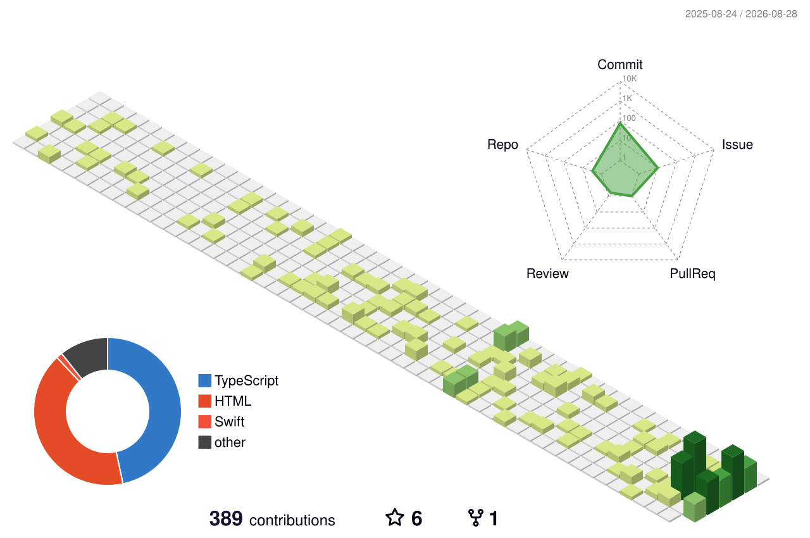

<h1 align="center">Hey 👋, I'm Zain Imam</h1>

  

  Test Automation Engineer building end-to-end frameworks across web, mobile, and API — and integrating AI agents into the QA workflow. 
  CI pipelines that cut release cycles by <b>~30%</b> · MCP-assisted authoring that cut test creation time by <b>~40%</b>. 
  <i>My professional work lives in private company repos — the projects below demonstrate the same patterns in public.</i>

 

<h3 align="left">🔭 Featured work</h3>

<table align="center">
  <tr>
    <th width="50%">
      <a href="https://github.com/Zain-Imam/playwright-e2e-framework">🧪 playwright-e2e-framework</a>
    </th>
    <th width="50%">
      <a href="https://github.com/Zain-Imam/playwright-mcp-ai-testing">🤖 playwright-mcp-ai-testing</a>
    </th>
  </tr>
  <tr>
    <td>
      Production-style E2E framework — Page Object Model, custom fixtures, data-driven tests, tag-based <code>@smoke</code>/<code>@regression</code> suites.
    </td>
    <td>
      AI-augmented testing with the Playwright MCP server — a documented authoring session, the agent's raw draft preserved verbatim, and the human-refined suite CI runs.
    </td>
  </tr>
  <tr>
    <td align="center">
       
      
      
      
    </td>
    <td align="center">
       
      
      
      
    </td>
  </tr>
</table>

  <b>Also built:</b> <a href="https://github.com/Zain-Imam/iina-episode-info">🎬 iina-episode-info</a> — a TMDB episode-info &amp; subtitle-search plugin listed in the <a href="https://github.com/iina/iina#community-plugins">official community plugins directory</a> of <a href="https://github.com/iina/iina">IINA</a> , the popular open-source macOS video player.

 

<h3 align="left">🛠️ Toolbox</h3>

  
  
  
  

  
  
  

  
  
  

  
  
  
  

 

<h3 align="left">📫 Connect with me</h3>

  
  
  

 

  

  

  

